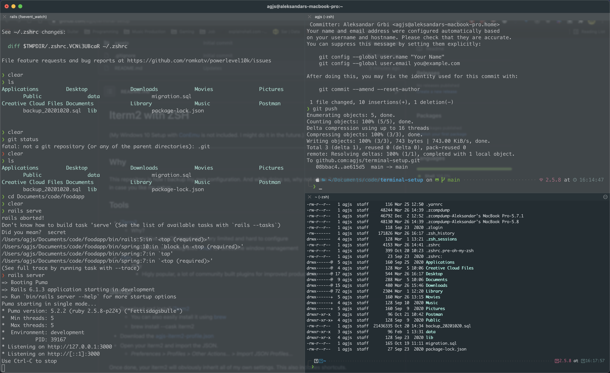

# 🤖 iterm2 with ZSH

- (My Windows 10 Setup with [ConEmu](https://conemu.github.io/) is not included. I might do it in the future.)
- Included setup should work on both, macOS and Linux

---



## Preface

Even if you don't fully appreciate the style and feel of the entire setup, I do truly believe that it can give you a good starting point to further style and configure things to your likings. I have spent significant time playing with various setups and tools and I believe that this one can satisfy needs of most workflows.

---

## Tools

- [iTerm2](https://iterm2.com/)
  - Why?
    - Native macOS terminal is very limited and hard to configure
    - Comes with integrated [tmux](https://github.com/tmux/tmux/wiki) for awesome window management
- [ZSH](https://ohmyz.sh)
  - Why
    - Higly popular, a lot of community built plugins for improved productivity

## Setup

Install [iTerm2](https://iterm2.com/)

```bash
brew install --cask iterm2
```

Download [agjs-iterm2-profile.json](./assets/settings/agjs-iterm2-profile.json)

Open your iTerm2 and import the JSON.

> Preferences > Profiles > Other Actions... > Import JSON Profiles...

Once done, your iTerm2 will obviously inherit all of my own settings. This also includes shortcuts.

---

### ZSH Theme - [powerlevel10k](https://github.com/romkatv/powerlevel10k#oh-my-zsh)

You can either follow the instructions here or directly on the provided link above.

```bash
git clone --depth=1 https://github.com/romkatv/powerlevel10k.git ${ZSH_CUSTOM:-$HOME/.oh-my-zsh/custom}/themes/powerlevel10k
```

This will install the specified theme into the custom themes directory. This is where all the custom ZSH themes reside.

Once the theme is cloned, we'll have to change our _.zshrc_ file. In case you are unfamiliar with _.zshrc_, this is the main configuration file where ZSH defines all its settings.

```bash
vi ~/.zshrc
```

Find the _ZSH_THEME_ and set it to powerlevel10k/powerlevel10k.

```bash
ZSH_THEME="powerlevel10k/powerlevel10k"
```

Quit vim and source the _~/.zshrc_ so changes are propagated.

```bash
source ~/.zshrc
```

At this point, you have two choices. Either use the provided _~/.p10k.zsh_ file I've included in this repo or configure the theme on your own. The mentioned file defines all the configuration for the previously installed theme.

If you decide to include my own file, don't worry. You can always reconfigure it by running:

```bash
p10k configure
```

#### Using my own p10k.zsh configuration file

- Download the [.p10k.zsh](./assets/settings/.p10k.zsh)
- Put it inside _~/.p10k.zsh_ (your $HOME directory, ls -a $HOME)
- Completely quit and reopen iTerm2

#### Fresh

- Completely quit and reopen iTerm2
- Go through the configuration wizard invoked by p10k. The wizard will be automatically shown in your terminal as that will be the first session running using previously installed theme. In case you mess up and you don't like the choices you made, as I previously said, simply run _p10k configure_ and run through the wizard again.

---

### iTerm2 Shortcuts

You are obviously free to change those at any point. If you decide to do so and you are unsure how, simply _open iTerm2 preferences and go to profiles > keys and click the ➕ icon_.

If you are a gamer like myself, I'd suggest you to set the shortcuts in the way you would set them up in a video game. This helps with not getting cognitively overloaded. If you already have mappings in your head, and your brain and hands are already in sync (just like playing a guitar), no need to reinvent the wheel.

- Open/Close iTerm2: **SHIFT + CMD + 1**
- Open New Window: **CMD + N**
- Vertial Split: **CMD + D**
- Horizontal Split: **CMD + G**
- Cycle Backwards: **CMD + [**
- Cycle Forward: **CMD + ]**

Those are all iTerm2 shortcuts I use. There are many ones you can set up, I simply didn't need more.

---

## Git

#### Better git diff

Native git diff is pretty horrendous. It's incredibly difficult to read. Due to that, I'm using [Delta](https://github.com/dandavison/delta).

```bash
brew install git-delta
```

We have to tell our Git to use a different [pager](https://git-scm.com/book/en/v2/Customizing-Git-Git-Configuration#_core_pager). Pager is essentially a function that formats the output of a git log and git diff commands.

```bash
# sets delta as the default pager
git config --global core.pager delta
```

Once setup, give it a shot. Try some _git diff_, _git show_ and see if you like the output. If you don't like the output and you would like the old one back, simply set the pager to the default one

```bash
# sets delta to the default pager, which is less
git config --global core.pager less
```

For more configuration options, make sure to read this awesome article I found at [dev.to](https://dev.to/cloudx/delta-a-new-git-diff-tool-to-rock-your-productivity-2773). All credit to the [author](https://dev.to/navarroaxel).

### Aliases

- alias.st=status -sb
- alias.lg=log --oneline
- alias.last=log -1 HEAD --stat
- alias.gl=config --global -l
- alias.se=!git rev-list --all | xargs git grep -F
- core.pager=delta

# Contributions

If you have any tips and tricks that you think are worth sharing, feel free to share them in the [discussions section](https://github.com/agjs/iTerm2-with-ZSH/discussions). I will make sure to include any of it into the repository and credit you for that. Alternatively, if you are an author of a similar repository, feel free to share the link and I will include it as well.
